# Car Rental App (Auto Rent Premium)🚗

A **full-stack vehicle rental application** built with a Flutter mobile frontend and a Spring Boot REST backend.

Customers can browse vehicles, filter and search by brand, type, or model, view details and photos, save favorites, pick rental dates and durations, create reservations, and pay using **KHQR / Bakong**.

- **Frontend repository:** `flutter_frontend` — Flutter / Dart
- **Backend repository:** `spring_backend` — Java / Spring Boot
- **Repository:** `https://github.com/ETEC-Spring-Final/flutter_frontend`

---

## 📸 docs/Screenshots

| Screen | Image |
|---|---|
| Splash | 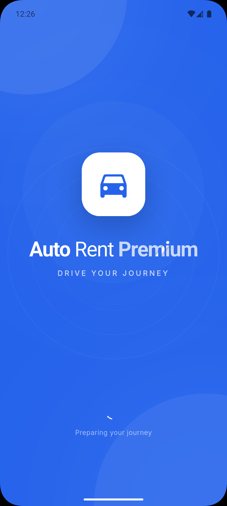                             |
| Onboarding | 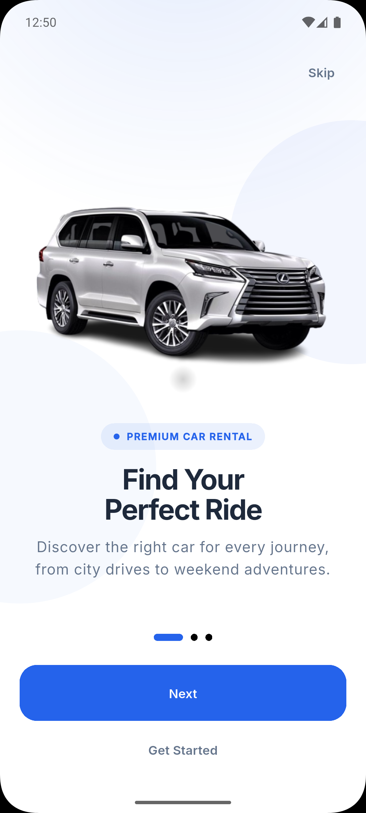                 |
| Onboarding | 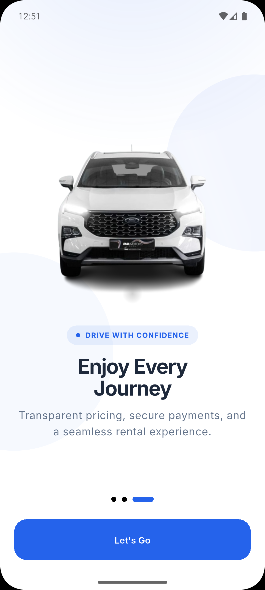               |
| Login | 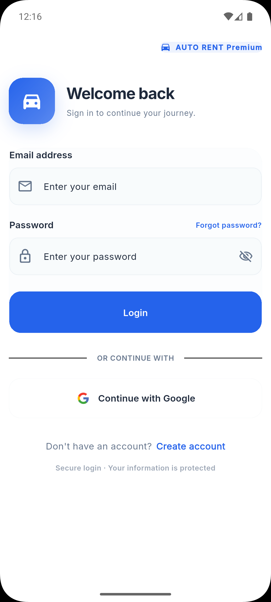                                |
| Register | 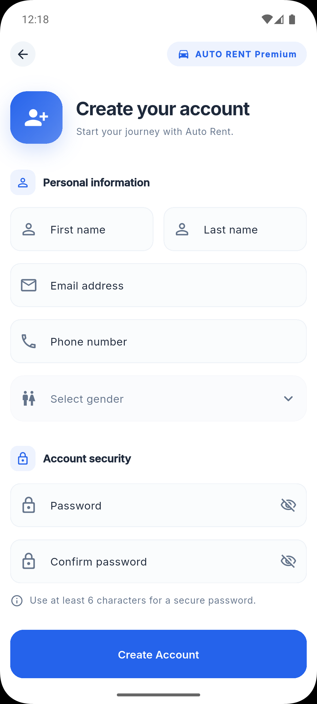                       |
| Home | 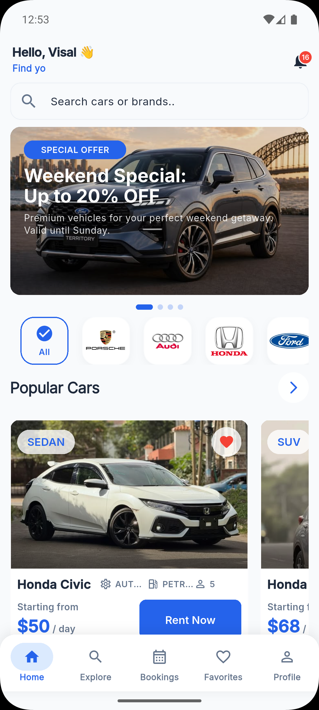                                   |
| Explore / Vehicle List | 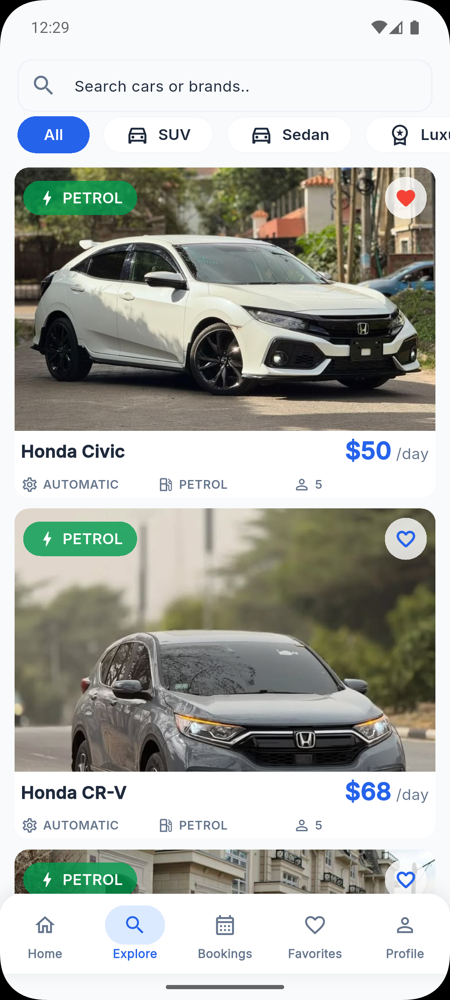           |
| Vehicle Detail | 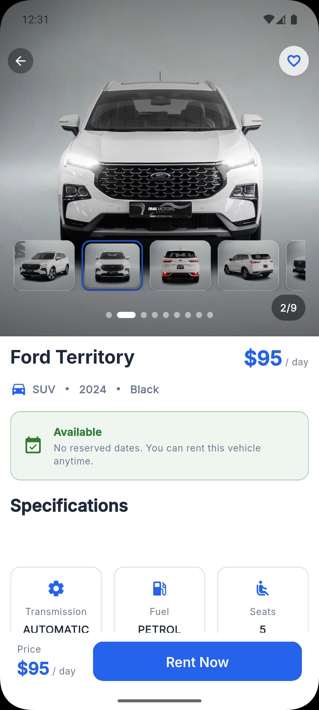     |
| Vehicle Detail | 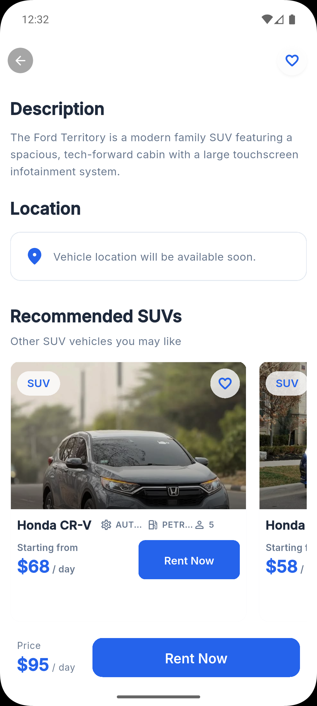   |
| Booking / Rental | 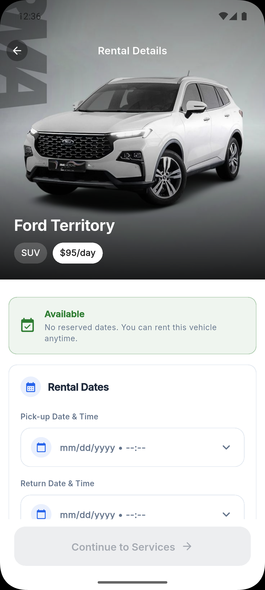                 |
| Booking / PickDate | 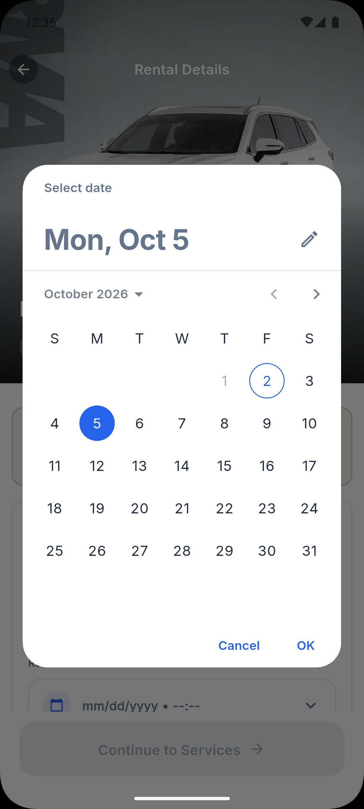             |
| Booking / PickTime | 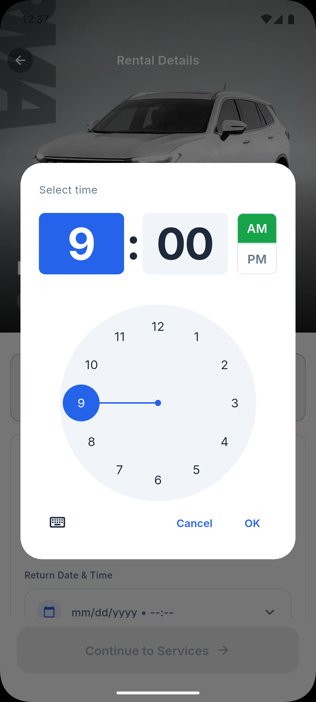             |
| Booking / Rental | 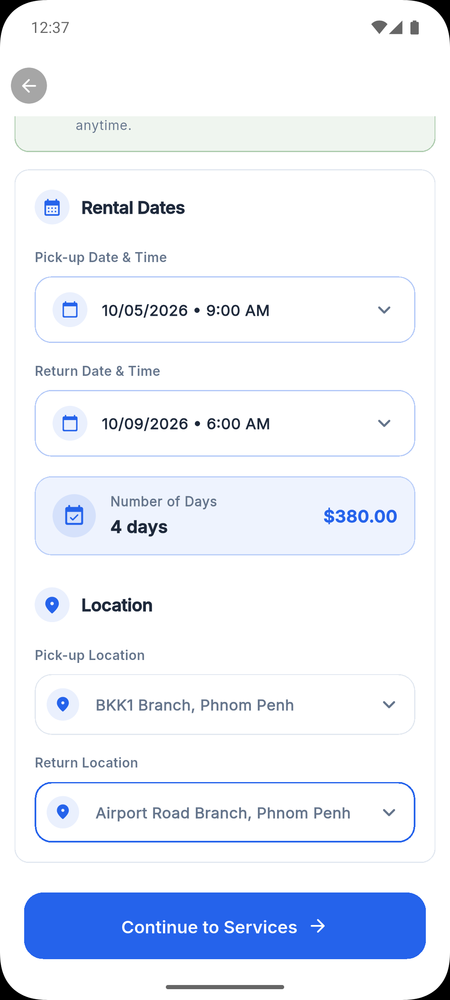               |
| Additional Service | 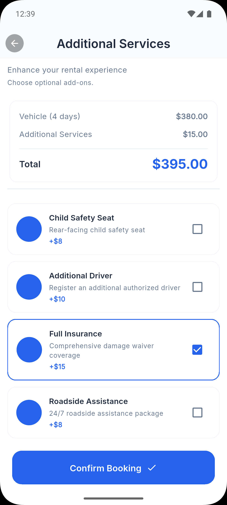               |
| Payment (KHQR) | 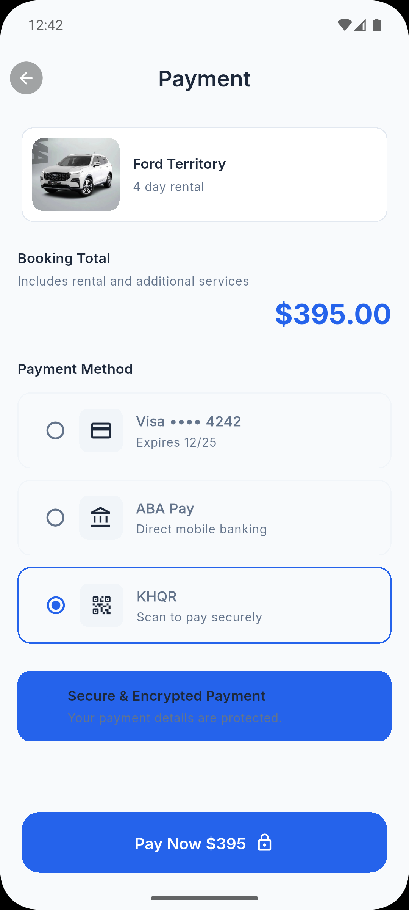                   |
| Generate QR (KHQR) | 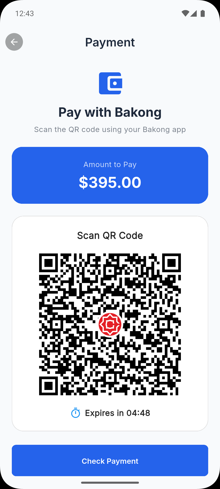                 |
| Booking Complete | 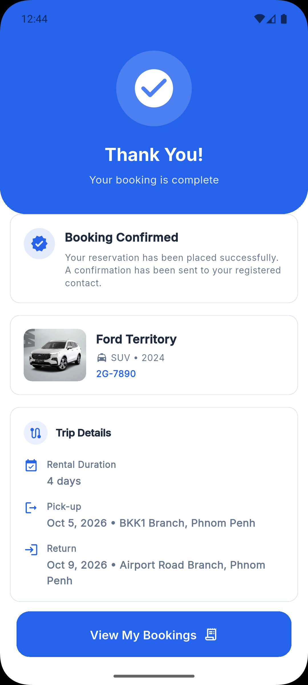               |
| Booking Complete | 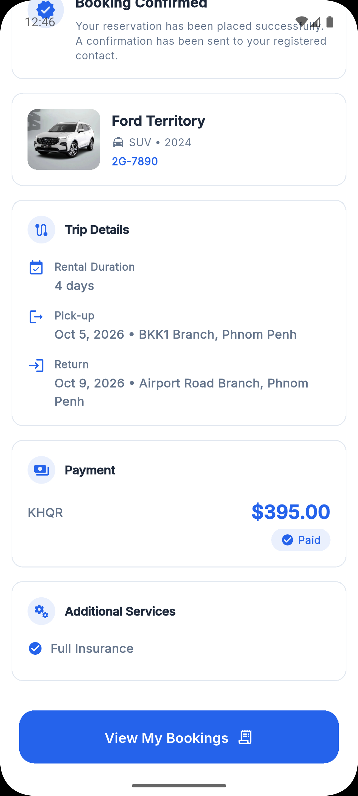             |
| Booking History | 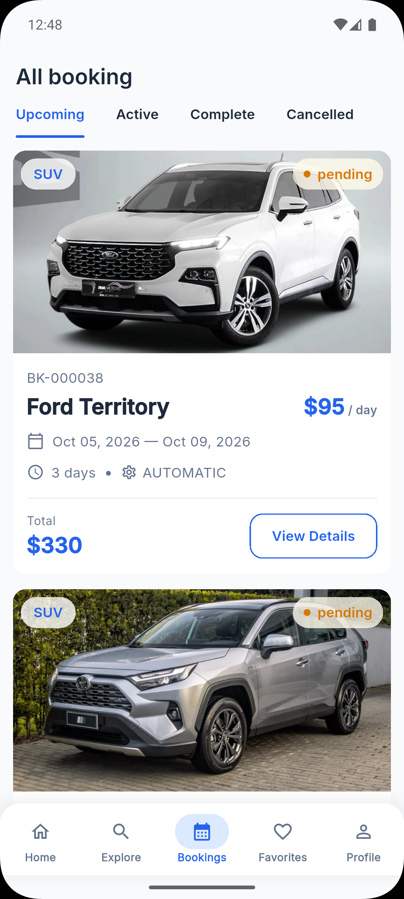  |
| Favorites | 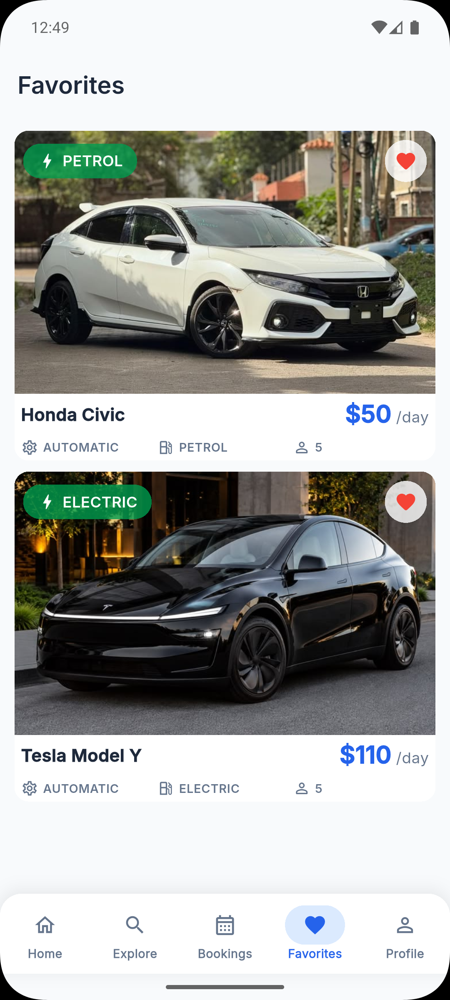                      |
| Profile | 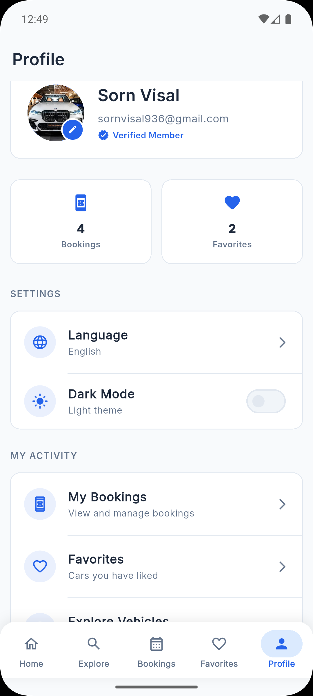                          |
| Shimmer | 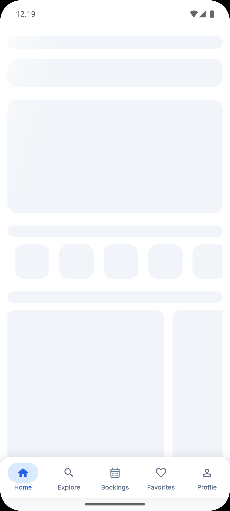                          |

---

## ✨ Key Features

### Account & Authentication

- Register, login, and logout
- Forgot password and reset password
- **Google OAuth** login

### Vehicle Discovery

- Browse the vehicle catalogue
- Search vehicles by model
- Filter by **brand** and **vehicle type**
- View vehicle details, specifications, and multiple images
- Add / remove and view **favorite** vehicles

### Booking

- Select rental (pickup and return) dates
- Select pickup / return time
- Rental duration summary
- Create a reservation
- View booking history and booking status
- Rental price calculation

### Payment

- Initiate payment for a reservation
- Display **KHQR** QR code
- **KHQR / Bakong** payment flow and status check
- View payment information

### Account

- Manage user profile

---

## 🛠 Tech Stack

### Frontend — `flutter_frontend`

| Area                 | Technology                                                         |
| -------------------- | ------------------------------------------------------------------ |
| Language             | **Dart**                                                           |
| Framework            | **Flutter**                                                        |
| State Management     | **BLoC / flutter_bloc**                                            |
| Navigation           | **GoRouter**                                                       |
| Networking           | **Dio**                                                            |
| Dependency Injection | **GetIt**                                                          |
| Responsive UI        | **flutter_screenutil**                                             |
| Typography           | **Google Fonts**                                                   |
| Local Storage        | **shared_preferences**, **flutter_secure_storage**                 |
| Localization         | **Flutter `gen_l10n`** (English, Khmer)                            |
| Theming              | Light / Dark theme with BLoC                                       |
| Utilities            | Equatable, fpdart, intl, shimmer, cached_network_image, qr_flutter |

### Backend — `spring_backend`

| Area          | Technology                         |
| ------------- | ---------------------------------- |
| Language      | **Java**                           |
| Framework     | **Spring Boot**                    |
| Security      | **Spring Security**, **JWT**       |
| Persistence   | **Spring Data JPA**, **Hibernate** |
| Database      | **PostgreSQL**                     |
| API Style     | **REST API**                       |
| Documentation | **Swagger / OpenAPI**              |

### Architecture & Patterns

- **Clean Architecture**
- **Layered Architecture**
- **MVVM**
- **BLoC**
- **Repository Pattern**
- **Dependency Injection**

---

## 🏗 Architecture

The frontend is split into three layers per feature (`presentation → domain → data`). The backend follows a Controller → Service → Repository → JPA structure.

```text
Flutter UI  (presentation/bloc, presentation/view)
    ↓
BLoC  (events in → states out)
    ↓
Use Case  (domain/usecase)
    ↓
Repository  (domain/repository interface)
    ↓
Data Source / API Client  (data/datasource, data/model, data/mapper)
    ↓
Dio  (with interceptors)
    ↓
Spring Boot REST API  (controller)
    ↓
Service  (service + service/impl)
    ↓
Repository  (repository + specification)
    ↓
PostgreSQL  (via Spring Data JPA / Hibernate)
```

**Frontend feature module (Clean Architecture)**

```text
lib/feature/<feature>/
├── presentation/
│   ├── bloc/      # BLoC, events, states
│   ├── view/      # Screens (widgets)
│   └── widgets/   # Feature-specific UI components
├── domain/
│   ├── entity/    # Pure business models
│   ├── repository/# Abstract repository contracts
│   └── usecase/   # Single-responsibility use cases
└── data/
    ├── datasource/# Remote data sources
    ├── model/     # JSON models
    ├── mapper/    # model ⇄ entity
    └── repository/# Repository implementations
```

**Backend layering**

```text
Controller  →  Service  →  Repository  →  JPA Entity
   (DTOs in/out)   (business logic)   (queries)   (PostgreSQL)
```

---

## 🔄 Main Application Flows

### Booking flow

```text
Browse Vehicle
      ↓
Vehicle Details
      ↓
Select Rental Date
      ↓
Select Rental Duration
      ↓
Create Reservation
      ↓
Payment
      ↓
KHQR / Bakong
      ↓
Payment Status
      ↓
Booking History
```

### JWT authentication flow

```text
Login
  ↓
Spring Boot Authentication
  ↓
JWT Token
  ↓
Flutter stores token
  ↓
Dio sends token with requests
  ↓
Spring Security validates token
```

---

## 📁 Flutter Project Structure

```text
flutter_frontend/
├── lib/
│   ├── main.dart
│   ├── app/
│   │   ├── app.dart
│   │   ├── config/           # App + environment configuration
│   │   ├── router/           # GoRouter setup, route names, route constants
│   │   ├── theme/            # Colors, dimensions, text styles, light/dark themes
│   │   │   └── bloc/         # Theme BLoC
│   │   └── locale/           # Locale BLoC
│   ├── core/
│   │   ├── constants/        # API constants, app constants, storage keys
│   │   ├── di/               # GetIt injection container (per-module registrations)
│   │   ├── errors/           # Failures, exceptions, error handler
│   │   ├── extensions/       # Context, string, num extensions
│   │   ├── network/          # Dio client, API client, endpoints, interceptors
│   │   ├── storage/          # Local + secure storage services
│   │   └── widgets/          # Shared/reusable widgets
│   ├── feature/              # Feature modules (auth, vehicle, rental, booking,
│   │                         # payment, favorite, profile, notification,
│   │                         # home, onboarding)
│   └── l10n/                 # Generated localizations + .arb files
├── assets/                   # Images and icons
├── android/  ios/  web/  windows/  linux/  macos/
└── pubspec.yaml
```

### Feature modules

| Module         | Purpose                                                           |
| -------------- | ----------------------------------------------------------------- |
| `auth`         | Register, login, forgot/reset password, Google OAuth              |
| `home`         | Home screen, banners, popular cars, bottom navigation             |
| `vehicle`      | Vehicle listing, search, filter, details, images, favorites entry |
| `rental`       | Rental/booking flow, confirmation, additional services            |
| `booking`      | Booking history, booking detail                                   |
| `payment`      | KHQR payment and transaction status                               |
| `favorite`     | Favorite list and toggle state                                    |
| `profile`      | User profile read/update                                          |
| `notification` | Notification inbox and read state                                 |
| `onboarding`   | Splash and onboarding screens                                     |

---

## 📁 Backend Project Structure

```text
spring_backend/
├── src/main/java/com/example/spring_boot_project_api/
│   ├── config/               # SecurityConfig, JwtAuthFilter, OpenApiConfig,
│   │                         # OAuth2 handlers, Cloudinary/Upload config
│   ├── controller/           # REST controllers per resource
│   ├── dto/
│   │   ├── request/          # Request DTOs per domain
│   │   └── response/         # Response DTOs per domain
│   ├── enums/                # Domain enums
│   ├── exception/            # Exception handling
│   ├── mapper/               # Entity ⇄ DTO mappers
│   ├── model/                # JPA entities
│   ├── repository/           # Spring Data JPA repositories
│   ├── service/              # Service interfaces + service/impl
│   ├── specification/        # JPA Specifications for filtering/search
│   └── util/                 # Utilities
├── src/main/resources/application.properties
└── pom.xml
```

---

## 🔐 Authentication

**Backend**

- `SecurityConfig` defines the filter chain and endpoint authorization rules
- `JwtAuthFilter` validates the token on every protected request
- Token-based login/refresh/logout endpoints under `/auth`
- Password reset with emailed token (`/auth/forgot-password`, `/auth/reset-password`)
- Google OAuth2 login with a custom success/failure handler that issues the app's JWT
- Swagger / OpenAPI documentation via `OpenApiConfig`

**Frontend**

- Auth **BLoC** manages login, register, forgot-password, and reset-password states
- Successful login returns an entity that is mapped to a data model
- Token is persisted with **flutter_secure_storage** (encrypted, platform-specific)
- `AuthInterceptor` attaches `Authorization: Bearer <token>` to outgoing requests and skips `/auth/` paths
- `LoggingInterceptor` assists debugging
- Route guards in GoRouter separate authenticated and unauthenticated navigation

---

## 🚙 Vehicle Management

- Vehicle REST APIs expose the catalogue with **search and filtering** parameters
- Filtering by **brand**, **vehicle type**, and **model**
- Vehicle detail includes specifications and multiple images (gallery with thumbnails)
- Booked-date lookup so unavailable days can be shown on the calendar
- On the frontend: `vehicle_bloc` → `get_vehicles_use_case` / `get_vehicle_by_id_use_case` → repository → remote data source
- Models are converted to entities through dedicated mappers

---

## 📅 Booking and Reservation

- Reservation APIs to create, list, and track the current user's reservations
- Booking details include pickup/return location, date range, time, and duration
- Price calculation is derived from the selected duration and any additional services
- Booking history and status are retrieved for the signed-in customer
- `booking_bloc` and `rental_bloc` handle booking form state, confirmation, and history states

---

## 💳 KHQR / Bakong Payment

Payment integrates Cambodia's **Bakong** APIs to produce an EMVCo-compatible **KHQR** code.

```text
Reservation created
      ↓
Payment screen
      ↓
POST /v1/bakong/generate-qr      → KHQR payload
POST /v1/bakong/qr-image         → QR image data
      ↓
Rendered with qr_flutter
      ↓
User pays with a banking app
      ↓
POST /v1/bakong/check-transaction (md5 hash)
      ↓
Payment status → confirmed / pending
      ↓
Booking history reflects payment state
```

- Frontend: `payment_bloc` with create-QR and check-payment use cases
- Backend: `BakongController` / `BakongService` / `BakongTokenService`

---

## 🌐 API Communication

**Frontend**

- Single configured **Dio** instance created in the GetIt container (`network_injection.dart`)
- Base URL is injected at build time:

```bash
flutter run --dart-define=apiBaseUrl=http://10.0.2.2:8080/api
```

- Endpoint paths are centralized in `ApiEndpoints` / `ApiConstants`
- Interceptors: `AuthInterceptor` (token), `LoggingInterceptor` (debug logging)
- Responses are mapped from JSON models to domain entities through mappers
- Failures are modelled as `Failure` objects and translated by a central `ErrorHandler`, so the UI can render consistent error, loading, and empty states

**Backend**

- REST controllers returning DTOs
- Validation on request DTOs
- Centralized exception handling
- Full API documentation exposed through **Swagger / OpenAPI**

Representative endpoints used by the app:

| Area          | Endpoint                                                                                         |
| ------------- | ------------------------------------------------------------------------------------------------ |
| Auth          | `/auth/login`, `/auth/register`, `/auth/logout`, `/auth/forgot-password`, `/auth/reset-password` |
| Profile       | `/user-profiles/me`                                                                              |
| Vehicles      | `/vehicles`, `/vehicles/{id}`, `/vehicles/{id}/booked-dates`                                     |
| Favorites     | `/favorites`, `/favorites/{vehicleId}`                                                           |
| Bookings      | `/rentals/my-rentals`, `/rentals/{id}`                                                           |
| Services      | `/services`                                                                                      |
| Locations     | `/locations`                                                                                     |
| Payment       | `/v1/bakong/generate-qr`, `/v1/bakong/qr-image`, `/v1/bakong/check-transaction`                  |
| Notifications | `/notifications/me/inbox`, `/notifications/me/read-all`                                          |

---

## 👨‍💻 My Contribution

I worked on **both the Flutter frontend and the Spring Boot backend** of this project.

### Flutter (mobile) — implemented by me

- UI development with responsive layouts using **flutter_screenutil**
- Authentication screens: login, register, forgot password, reset password, Google OAuth entry
- Home screen and Explore screen
- Vehicle listing, search, and filtering (brand, type, model)
- Vehicle detail screen with image gallery
- Favorite functionality (add/remove/list)
- Booking screens: date selection, time selection, duration summary
- Payment screen with KHQR display
- Booking history and booking detail
- **BLoC** state management for every feature
- **GoRouter** navigation and route guards
- **Dio** API integration with interceptors
- Error handling, loading states, empty states, shimmer placeholders
- Localization (English + Khmer)
- Light/dark theme management via BLoC
- Dependency injection with **GetIt**
- API models and mappers
- Repository implementations and use cases

### Spring Boot (backend) — implemented by my team

- REST API development
- Authentication APIs and **JWT** authentication
- **Spring Security** configuration and filter setup
- Vehicle APIs (listing, search, filtering, details, images, booked dates)
- Reservation / rental APIs
- Payment-related APIs (KHQR / Bakong)
- Service layer with implementations
- Repository layer using **Spring Data JPA**
- JPA entities and relationships
- **PostgreSQL** database integration
- Request validation and error handling
- **Swagger / OpenAPI** documentation

---

## 📚 What I Learned

- **Clean Architecture in a real project** — keeping presentation, domain, and data separated made features easy to read and change
- **State management with BLoC** — modelling every screen as events and states made loading, success, and error paths predictable
- **JWT-based security** end to end, from token issuance on the backend to interceptor attachment on the client
- **Clean API integration with Dio** — interceptors, centralized endpoints, mappers, and a shared error handler
- **Spring Boot + Spring Security** configuration and how a stateless REST API is protected
- **Spring Data JPA and Specifications** for dynamic search and filtering queries
- **Third-party payment integration** with Bakong/KHQR, including QR generation and transaction status checks
- **Dependency injection with GetIt** on the client and constructor injection on the server
- **Localization and theming** as first-class concerns rather than afterthoughts
- Working across frontend and backend on the same feature, which made API design much easier to reason about

---

## ▶️ How to Run the Project

### 1. Backend (Spring Boot)

Requirements: **JDK 17+**, **Maven**, **PostgreSQL**

```bash
# create the database
createdb car_rental

# configure environment variables (see Configuration below),
# then run
./mvnw spring-boot:run
```

The API is served on `http://localhost:8080/api`.

### 2. Frontend (Flutter)

Requirements: **Flutter SDK**, **Dart**

```bash
flutter pub get
flutter gen-l10n
flutter run --dart-define=apiBaseUrl=http://10.0.2.2:8080/api
```

- Android emulator: `10.0.2.2` points to the host machine
- Physical device: use your machine's LAN IP, e.g. `--dart-define=apiBaseUrl=http://192.168.x.x:8080/api`

---

## 🔧 Environment / Configuration

### Backend — environment variables

`application.properties` reads its secrets from environment variables:

| Variable                                    | Description                                       |
| ------------------------------------------- | ------------------------------------------------- |
| `DB_URL`                                    | PostgreSQL JDBC connection URL                    |
| `DB_USER`                                   | Database username                                 |
| `DB_PASSWORD`                               | Database password                                 |
| `JWT_SECRET`                                | Signing secret for JWT tokens                     |
| `JWT_EXPIRE`                                | Token expiry in milliseconds (default `86400000`) |
| `GOOGLE_CLIENT_ID` / `GOOGLE_CLIENT_SECRET` | Google OAuth credentials                          |
| `CLOUDINARY_*`                              | Cloudinary credentials used for image upload      |

```bash
export DB_URL=jdbc:postgresql://localhost:5432/car_rental
export DB_USER=postgres
export DB_PASSWORD=your_password
export JWT_SECRET=your_secret
```

### Frontend — build-time configuration

| Key          | Default                    | Description                                  |
| ------------ | -------------------------- | -------------------------------------------- |
| `apiBaseUrl` | `http://10.0.2.2:8080/api` | Backend base URL passed with `--dart-define` |

---

## 🔮 Future Improvements

- Automated testing (unit tests for BLoCs/use cases, integration tests for services)
- Refresh-token rotation with automatic retry on `401` in the Dio interceptor
- Push notifications for reservation and payment status updates
- More payment options and payment history
- Admin dashboard for fleet, reservations, and users
- Vehicle availability calendar improvements
- CI/CD pipeline and containerized deployment
- Performance and caching improvements for the vehicle catalogue

---

## 📌 Project Status

**Status: Completed core functionality / final project.**

Implemented end to end: authentication (including Google OAuth), vehicle browsing with search and filtering, favorites, the reservation flow, and the KHQR/Bakong payment flow. Actively maintained as a portfolio and reference project.

---

## 👤 Developer Information

```text
Developer: Sorn Visal
Role: Software Development Student & Mobile Developer
```

- GitHub: `https://github.com/ETEC-Spring-Final/flutter_frontend`

---

## 📄 License

This project is for educational and portfolio purposes.
